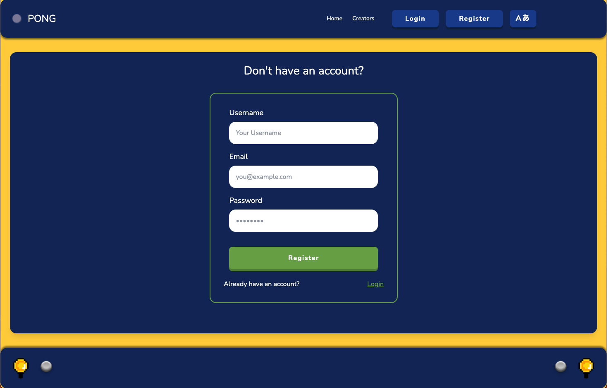
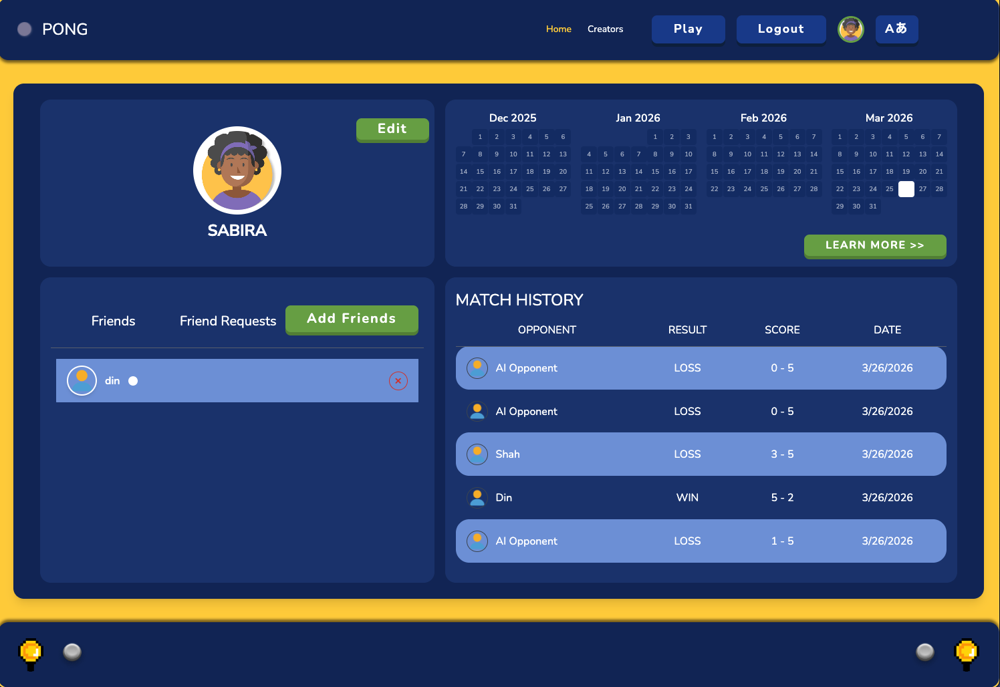
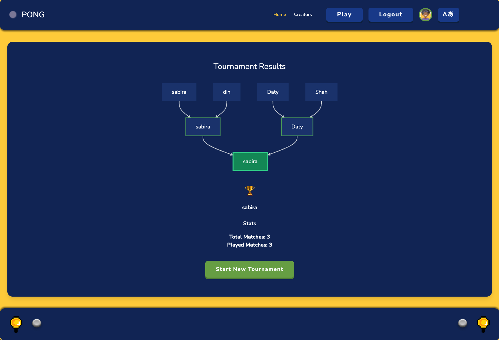
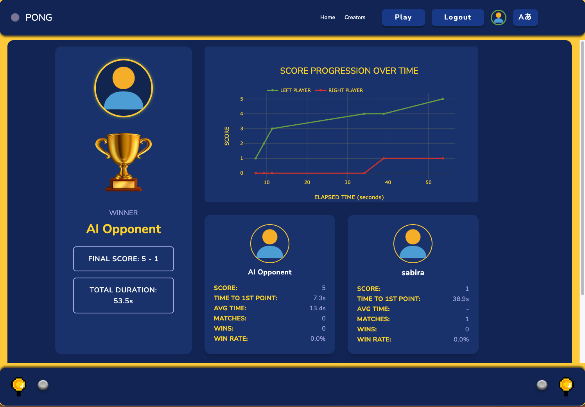

# 🏓 ft_transcendence

<div align="center">

A full-stack, real-time **Pong** web application built as the final project of the 42 School curriculum.  
Play against friends, challenge an AI, or compete in tournaments — all in your browser.


</div>

---

## 🎥 Demo & Screenshots

<p align="center">
  
</p>
<p align="center"><em>User authentication (login, registration, 2FA)</em></p>

<p align="center">
  
</p>
<p align="center"><em>User profile and account management</em></p>

<p align="center">
  
</p>
<p align="center"><em>Dynamic tournament bracket system</em></p>

<p align="center">
  
</p>
<p align="center"><em>Post-game analytics and match results</em></p>

---

## 📖 Project Overview

**ft_transcendence** is a modern, containerised web application centred around the classic Pong game.  
The project showcases a microservices architecture, real-time WebSocket communication, 3D rendering with Babylon.js, a full user management system (registration, login, and account settings), and a comprehensive social layer including friends, profiles, and tournaments.

### Goals

- Build a fully functional Pong game playable in the browser
- Implement user authentication with enterprise-grade security (JWT, 2FA, Google OAuth)
- Create a social ecosystem: friend requests, player profiles, and match history
- Support single-player (vs AI), local multiplayer, and bracket-style tournaments
- Deliver a multilingual, Single-Page Application (SPA) experience without using a heavy frontend framework

---

## 🛠️ Tech Stack

### Frontend
| Technology | Purpose |
|---|---|
| **TypeScript** | Core language for the entire SPA |
| **Vite** | Build tool & dev server |
| **Babylon.js** | 3D rendering engine for the Pong game |
| **Tailwind CSS** | Utility-first styling |
| **i18next** | Internationalisation (English, Russian, Spanish) |
| **Nginx** | Static file serving & reverse proxy with HTTPS |

### Backend
| Technology | Purpose |
|---|---|
| **Node.js** | Runtime for all backend services |
| **Fastify** | High-performance HTTP framework |
| **@fastify/jwt** | JWT-based session management |
| **@fastify/websocket** | Real-time WebSocket support for live games |
| **bcrypt** | Secure password hashing |
| **Prisma ORM** | Type-safe database access layer |

### Database
| Database | Used By |
|---|---|
| **SQLite** (`user-social.db`) | auth, profile, friends services (shared volume) |
| **SQLite** (`game-tournament.db`) | game-tournament service (dedicated volume) |

### Infrastructure
| Tool | Purpose |
|---|---|
| **Docker** | Containerisation of every service |
| **Docker Compose** | Multi-service orchestration |
| **Docker Volumes** | Persistent data storage across container restarts |

---

## ⚙️ Setup & Installation

### Prerequisites

- [Docker](https://docs.docker.com/get-docker/) and [Docker Compose](https://docs.docker.com/compose/) installed
- A `.env` file in the `srcs/` directory (see [Environment Variables](#environment-variables))

### Environment Variables

Create `srcs/.env` with the following variables:

```env
# Authentication
JWT_SECRET=your_super_secret_jwt_key

# Database paths (used internally by Docker)
DATABASE_URL=file:/app/prisma/data/user-social.db
GAME_DB_URL=file:/app/prisma/data/game-tournament.db

# Email (for 2FA OTP delivery)
EMAIL_USER=your_email@gmail.com
EMAIL_PASS=your_app_password

# Google OAuth
GOOGLE_CLIENT_ID=your_google_client_id
```

### Running with Make (Recommended)

```bash
# Clone the repository
git clone https://github.com/your-team/ft_transcendence.git
cd ft_transcendence

# Build and start all containers
make

# Stop all containers
make down

# Stop and remove all images
make clean

# Full cleanup (containers, images, volumes, uploads)
make fclean

# Rebuild everything from scratch
make re
```

### Running with Docker Compose

```bash
cd srcs

# Build all service images
docker compose build

# Start all services in the background
docker compose up -d

# View logs
docker compose logs -f

# Stop all services
docker compose down
```

### Accessing the Application

Once all services are running, open your browser and navigate to:

```
https://localhost:8080
```

> **Note:** The application uses a self-signed TLS certificate served via Nginx. You may need to accept a browser security warning on first load.

---

## ✨ Features

### 🔐 User Authentication (`auth-service` · port 5001)

- **Registration** — Create a new account with a unique username and email; passwords are hashed using bcrypt with 12 salt rounds
- **Login** — Credential-based login with normalised username handling
- **Google OAuth** — Sign in or register via Google; automatically links Google accounts to existing email accounts
- **Two-Factor Authentication (2FA)** — OTP codes delivered via email with a 5-minute expiry window; can be enabled or disabled per user
- **Session Management** — Secure `HttpOnly` + `Secure` JWT cookies with 1-hour expiry; automatic online/offline status tracking
- **Avatar Upload** — Serves user avatars as static files; downloads and caches Google profile pictures locally

### 🏓 Pong Game (`game-tournament-service` · port 5005)

- **3D Pong** — Real-time Pong game rendered with Babylon.js in the browser
- **Game Modes:**
  - **Local Multiplayer** — Two players on the same machine
  - **vs AI** — Single-player mode with a built-in AI opponent, with gameplay interactions synchronised via WebSockets 
- **Game Customisation** — Players can customise game settings before starting
- **Game Events** — Every point, pause, resume, and finish is logged to the database
- **Game Analytics Dashboard** — Post-game statistics visualizing gameplay trends and match outcomes

### 🏆 Tournament System (`game-tournament-service`)

- **Dynamic Single-Elimination Brackets** — Automatically generates tournament brackets for any number of participants
- **Flexible Player Registration** — Supports both registered users and guest players
- **Automated Match Scheduling** — Determines match order and advances winners through each round
- **Tournament Match History** — All tournament matches and results are stored for later review

### 👤 Profiles & Dashboard (`profile-service` · port 5002, `dashboard-service` · port 5004)

- **User Profiles** — View and edit username, avatar, and preferences
- **Match History** — Browse a chronological log of all past games with scores and outcomes
- **User Performance Dashboard** — A dedicated analytics view that aggregates data from both databases and surfaces per-user performance metrics:
  - Total matches played, total wins, and overall win rate
  - Average score per game
  - Longest win streak and current win streak
  - Visual breakdown of game and tournament history
  - Global leaderboard of players based on game activity and win rate

### 👫 Friends & Social (`friends-service` · port 5003)

- **Friend Requests** — Send, accept, or decline friend requests
- **Friends List** — View online/offline status of friends in real time
- **User Search** — Discover and view other players' public profiles

### 🌐 Internationalisation

- Full UI translation support for **English**, **Russian**, and **Spanish**
- Language preference is stored per user and persists across sessions
- Powered by `i18next` with automatic browser language detection

---

## 📁 Project Structure

```
ft_transcendence/
├── Makefile                          # Build & lifecycle commands
├── README.md
└── srcs/
    ├── docker-compose.yml            # Orchestrates all 6 containers
    ├── backend/
    │   ├── auth-service/             # Authentication, sessions, 2FA, Google OAuth
    │   │   ├── prisma/               # Prisma schema & migrations (user-social.db)
    │   │   ├── routes/               # auth.js — all auth endpoints
    │   │   ├── services/             # emailService.js, googleService.js
    │   │   ├── schemas/              # AJV validation schemas
    │   │   ├── uploads/avatars/      # Stored user avatar images
    │   │   └── server.js
    │   ├── profile-service/          # Profile viewing & editing
    │   │   ├── prisma/               # Shared user-social.db (read/write)
    │   │   ├── routes/
    │   │   ├── schemas/
    │   │   └── server.js
    │   ├── friends-service/          # Friend requests & social features
    │   │   ├── prisma/               # Shared user-social.db (read/write)
    │   │   ├── routes/
    │   │   ├── schemas/
    │   │   └── server.js
    │   ├── game-tournament-service/  # Pong game engine, AI, tournaments
    │   │   ├── ai/                   # AI opponent logic
    │   │   ├── prisma/               # Prisma schema & migrations (game-tournament.db)
    │   │   ├── routes/               # gameSession, gameSessionPlayers, tournament, ai, websocket
    │   │   ├── services/
    │   │   ├── schemas/
    │   │   └── server.js
    │   └── dashboard-service/        # Aggregated stats & analytics (read-only)
    │       ├── prisma/               # Read-only access to both databases
    │       ├── routes/
    │       ├── schemas/
    │       └── server.js
    └── frontend/
        ├── Dockerfile
        ├── nginx.conf                # Nginx HTTPS config & API proxying
        ├── package.json
        ├── vite.config.ts
        ├── tsconfig.json
        └── src/
            ├── main.ts               # App entry point
            ├── Router.ts             # Client-side SPA router
            ├── input.css             # Tailwind CSS entry
            ├── pages/                # All page components (Login, Register, Game, Profile, etc.)
            ├── components/           # Reusable UI components
            ├── graphics/             # Babylon.js 3D game assets & scene logic
            ├── services/             # API call layer (one file per backend service)
            ├── utils/                # Auth utilities, game customisation, common helpers
            └── locales/              # i18n translation files (en/, ru/, sp/)
```

---

## 🌐 Service Architecture

```
Browser (HTTPS :8080)
       │
       ▼
  ┌─────────┐
  │  Nginx  │  ← Reverse proxy / static file server
  └────┬────┘
       │ routes /api/* to backend services
       │
  ┌────┴──────────────────────────────────────────┐
  │               Docker Network: transcendence   │
  │                                               │
  │  auth        :5001   ─┐                       │
  │  profile     :5002   ─┼─ user-social.db       │
  │  friends     :5003   ─┘  (shared volume)      │
  │                                               │
  │  dashboard   :5004   ←  reads both DBs (RO)   │
  │                                               │
  │  game-tourna :5005   ── game-tournament.db    │
  │              :ws     ── WebSocket game sync   │
  └───────────────────────────────────────────────┘
```

---

## 👥 Team

| Member | Role / Responsibilities |
|---|---|
| [Sabira](https://github.com/mk-sabira) | 🎨 **Frontend & Game** — SPA architecture and overall website design, Babylon.js 3D game engine integration, Pong gameplay mechanics and 3D scene rendering, game customisation UI, AI opponent implementation, Vite/TypeScript build setup, Tailwind CSS styling |
| [Marsha](https://github.com/marsha-t) | ⚙️ **Backend Game & Tournament Services** — Game server architecture, real-time WebSocket game loop, AI opponent logic, tournament bracket system design and implementation, analytics dashboard service and per-user statistics (win rate, streaks, average score, match history aggregation) |
| [Rawan](https://github.com/rawanaljaberi) | 🔐 **Backend User Management & Social Services** — Standard user registration and login, JWT session management, Two-Factor Authentication (2FA) with email OTP, Google OAuth (remote authentication), user account management, and implementation of the friends-service including friend requests, friend list management, and user discovery |
| [Dina](https://github.com/dinaalamin00) | 🐳🎨 **DevOps, Frontend & i18n** — Docker containerisation, Nginx reverse-proxy and HTTPS configuration, microservices orchestration; frontend development of the profile page and its full integration with the user management backend; application-wide translation using i18next (EN / RU / ES) |

---

## 📝 Notes

- All backend services run exclusively inside Docker — no local Node.js installation is needed to run the project.
- The two SQLite databases are stored in named Docker volumes (`user-social-data`, `game-tournament-data`) and persist across `make down` / `make up` cycles.
- Running `make fclean` will wipe **all** volumes and uploaded avatars (except the bundled defaults). Use with caution.
- The Nginx container terminates TLS and forwards API requests to the appropriate backend service by path prefix.
